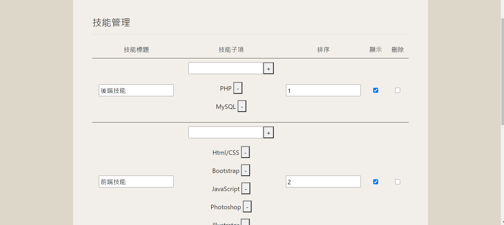

# 履歷規劃
## 作品集計畫
### 後端(PHP)作品
* 修改乙級題目(電影訂票)為個人作品
* 發票兌獎
* 萬年曆
### 前端作品
* JS小作業(sweet alert選擇故事)
* JS小作業(選色器)
* JS小作業(選色器)
* JS小作業(時鐘)

## 前台視覺設計
以米色，棕色為主色調，參考cakeresume樣板，設計成一頁式履歷

## 資料庫設計
>共有四個區塊(About Me/Education/Job/Skill/Portfolio/Contact Me)

* About Me :共三張資料表:img(大頭貼)/ab(自我介紹)/want(求職條件)
* Education :共一張資料表:edu(學歷)
* Job :共一張資料表:job(工作經歷)
* Skill :共兩張資料表:skill(技能主項目)/skillchild(技能子項目)
* Portfolio :共一張資料表:pf(作品資訊)
* Contact Me:共一張資料表:contact(聯絡資訊)
### 資料表:
#### 資料表名:img
##### 欄位:
* img:(大頭貼照片路徑)
* sh:顯示與否(只會有一個顯示)
#### 資料表名:ab(自我介紹)
##### 欄位:
* txt:(簡易自我介紹文字)
* sh:顯示與否(只會有一個顯示)
#### 資料表名:edu
##### 欄位:
* title:(經歷名稱)
* time:(經歷時間 ex:2019/1~2020/4)
* txt:(經歷說明)
* rank:(顯示順序)
* sh:顯示與否(多個顯示)
#### 資料表名:job
##### 欄位:
* title:(經歷名稱)
* time:(經歷時間 ex:2019/1~2020/4)
* txt:(經歷說明)
* rank:(顯示順序)
* sh:顯示與否(多個顯示)
#### 資料表名:skill(技能主項目)
##### 欄位:
* title:(技能主標題)
* sh:顯示與否(多個顯示)
* rank:(顯示順序)
#### 資料表名:skillchild(技能子項目)
##### 欄位:
* skillChild:(技能分類)
* parent:(所屬主項目)->該skill的id
##### 刪除技能主標題時會一起刪除子項目
#### 資料表名:contact(聯絡資訊)
##### 欄位:
* title:(聯絡標題)
* sh:顯示與否(多個顯示)
#### 資料表名:want(求職條件)
##### 欄位:
* title:(條件標題)
* sh:顯示與否(多個顯示)
#### 資料表名:pf(作品集)
##### 欄位:
* title:(作品標題)
* txt:(作品說明)
* href:(作品連結)
* img:(作品縮圖)
* sh:顯示與否(多個顯示)
## 功能規劃
後臺參考網頁設計以及第一題，但不做彈出視窗與更新圖片，單純表單傳值到api做資料的新增與修改。
技能的主項目可直接輸入並新增或刪除，但無法編輯。

### 未來計畫:
* 參考cakeresume履歷產生方式，搭配ajax使前台可直接進行編輯並修改資料庫的資料。

## 作品縮圖預覽

